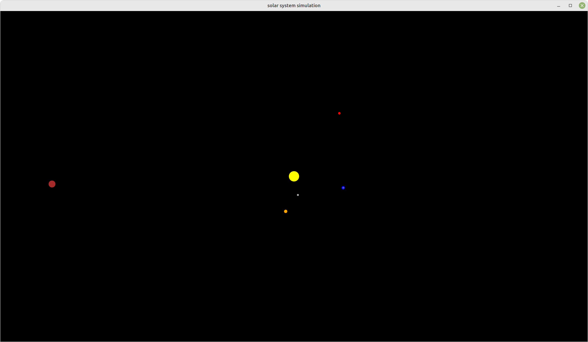

# Gravity Simulator


[](https://www.gnu.org/licenses/gpl-3.0)

## Description
This project aims to simulate gravity forces between bodies in order to render our solar system.

## Getting Started
These instructions will get you a copy of the project up and running on your local machine for development and testing 
purposes.

### Prerequisites
* Java 18
* Maven 3.8.6
* Git 2.25.1

### Installing and running
* Clone the repository from GitHub:
```shell
git clone https://github.com/Achaaab/gravity-simulator.git
```
* Build and run the project with Maven:
```shell
cd gravity-simulator
mvn javafx:run
```

### Usage
* [SCROLL UP] : about 22% zoom in (it may depend on your mouse configuration)
* [SCROLL DOWN] : about 22% zoom out (it may depend on your mouse configuration)
* [TAB]: next anchor body (the anchor body is fixed at the center of the window)
* [SHIFT] + [TAB] : previous anchor body
* [+] : increase time scale by a factor 3/2
* [-] : decrease time scale by a factor 3/2

### Screenshot


## Improvements
* Bodies start at their apoapsis point, which is fixed on the right. This is probably not realistic and could be 
  improved.
* A menu would be nice to explain usage.
* A tri-dimensional version would be great.

## Contributing
Open bar.

## Authors
* **Jonathan Guéhenneux** - *Developer* - [Achaaab](https://github.com/Achaaab)

## License
This project is licensed under the GNU General Public License (GPL) - see the [LICENSE.md](LICENSE.md) for the details.
